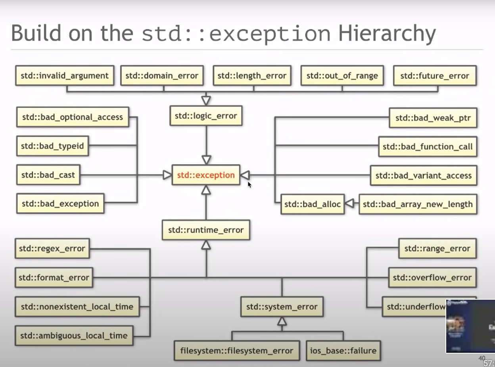

# LabB : Exception and standard library overview

## HW1 Macroprocessor review

see [notes](../hw1_notes.md)

## HW2

see ReCodex

## Exceptions

**How to handle errors without Exceptions**
* return error codes, prefere `class enum`
* return pair (like `std::map::insert`)
* return pointer (can indicate returning `std::nullptr` - discouraged) or better yet `std::optional<T>`
* return invalid value (shouldn't be special one like -1) but something like `container.end()`
    * unix ret -1 is nice conterexample that proves the rule :-) in general we want to avoid special magic values as much as possible
* output parameter `retval foo(err& error);`

```c++
void bar() {
    throw CustomException();
}

void baz() {
    DatabaseConnection connection{"10.5.5.5"};
    bar()
}

void foo() {
    try {
        baz();
    } catch (const CustomException &) {
        // Handle CustomException, log error...
    }
}
```

**Exception vs. Asserts**
Exceptions should prevent errornous behavior not a buggy one.
Feel free to leave asserts in code.
Compiler omits them entirely (zero runtime overhead) and they give reader better understanding of the code.

**Stack unwinding and RAII**
* doesn't happen if an exception is *not* caught. Then it calls `terminate` which might not release all the acquired resources.
* RAII - *Resource Acquisition is Initialization*
    * or rather *Resource Release is Destruction*!

**Catch:**
* catch all `catch (...)`
* catch by value/reference `catch (const std::exception &)`

`std::exception` hierarchy:
[cppreference on std::exception](https://en.cppreference.com/w/cpp/error/exception)


**Rules:**
* Exception are very slow in the failure case
* They break the control flow and should never be used on "expected" control flow
* Only use them exceptionally :-)
* If you use exception always catch all the possible error you can throw otherwise the stack unwinding might not occure.
* Destructor *CANNOT FAIL*
    * it is part of stack unwinding, if it were to throw it would break resouce release
    * compiler markes them `noexcept` by default

**Exception safety guarantees**
Specifies how does a part of code deal with exceptions.
For example, the simplest case is that it does not use exceptions (and cannot handle them) at all.
Your code's behavior may conform to one of these three variants:

1. No throw guarantee
    * operation cannot throw an exception -> `noexcept`

2. Basic guarantee
    * invariants are preserved
    * no resources are leaked

3. Strong exception safety guarantee
    * invariants are preserved
    * no resources are leaked
    * the state did not change (commit or rollback)
    * this is not always possible (communication over network makes it hard to do rollback)

**Additional Sources:**
* [cppcon BackToBasics track talk on exceptions](https://www.youtube.com/watch?v=0ojB8c0xUd8&ab_channel=CppCon)
* [cppcon BackToBasics track talk on RAII and rule of zero](https://www.youtube.com/watch?v=7Qgd9B1KuMQ&ab_channel=CppCon)
* [what is rethrow](https://stackoverflow.com/questions/2360597/c-exceptions-questions-on-rethrow-of-original-exception)
* gtest can also expect a throw using `EXPECT_THROW`

### Task1: What is good exception usage in Makroprocessor HW?

### Task2: Find and try to implement what a reasonable exception usage in [labA/ncvec.h](../labA/ncvec.h)

## C++ Standard Library

Just click on links from [cppreference](https://en.cppreference.com/w/).

### [\<string_view\>](https://en.cppreference.com/w/cpp/string/basic_string_view)

### [\<regex\>](https://en.cppreference.com/w/cpp/regex)

### [I/O libraries](https://en.cppreference.com/w/cpp/io)

### [\<filesystem\>](https://en.cppreference.com/w/cpp/filesystem) (since C++17)

### [\<chrono\>](https://en.cppreference.com/w/cpp/chrono)

### [\<random\>](https://en.cppreference.com/w/cpp/numeric/random)
* simple C interface is `rand()` but that might not always suffice

### [\<numeric_limits\>](https://en.cppreference.com/w/cpp/types/numeric_limits) and [\<numbers\>] for some constants

### [\<thread\>](https://en.cppreference.com/w/cpp/thread) and [<atomic>](https://en.cppreference.com/w/cpp/thread)


## What is missing (as of C++ 20) and you are stuck with C-interface (man 3)

* Networking :-(
